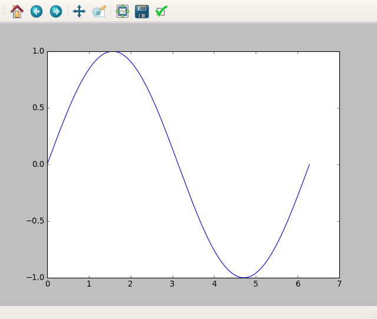

# Pythonの科学計算系パッケージ
充実しすぎていて説明しきれないので、
今回は「こんなんがあるよ」程度にザックリ説明していきます。

## Numpy (多次元配列操作)

### Numpyが無いと始まらない
Numpyとは多次元配列クラス (numpy.ndarray) と、それを扱うための関数群が集まったパッケージ。
数値計算はベクトルやら行列やらをどうこうする話がほとんどなので、
Pythonの全ての科学系パッケージはNumpyに依存していると言っても過言では無いです。
とにかく、Pythonが数値計算に強いのはまずNumpyの存在があってこそです。

### Numpyだけでも強い
他の科学計算系パッケージから使用されることで真価を発揮するNumpyですが、単体でも十分強力です。
線形代数の教科書に載ってるような計算はもちろん、
平均値や分散の計算、乱数生成、FFT、CSVファイルの読み書きなど
大抵のことはNumpy単体で行えてしまいます。

細かい違いはあるものの、MATLAB系の数値計算ソフトと同じ気分で使えます。
``` MATLAB
% in MATLAB
A = [1, 4; 2, 3]
B = 2 * A'
```
``` python
# in numpy
import numpy as np
A = np.array([[1, 4], [2, 3]])
B = 2 * A.T
```

### Numpyは速い
Numpyの内部はC言語やFortranで実装されているので非常に高速です。
例えば次の2つのコードの場合、Numpy版のほうが40倍ほど速かったです。
(importの時間は除く)
``` python
# 普通のpython
import math

x = range(10 ** 6)
square = (x_i ** 2 for x_i in x)
mean_square = sum(square) / float(len(x))
root_mean_square = math.sqrt(mean_square)
```
``` python
# numpy
import numpy as np

x = np.arange(10 ** 6)
square = x ** 2
mean_square = np.mean(square)
root_mean_square = np.sqrt(mean_square)
```
※ ただしNumpyの配列をforループで処理しようとすると
普通のPythonのlistを使うときよりも (かなり) 遅くなるので注意が必要です。

## Matplotlib (グラフ描画)

### Numpyだけではグラフは描けない
単体でも相当便利なNumpyですが、グラフの描画はできません。
グラフの描画にはMatplotlibを使います。
Matplotlibは3次元プロットやアニメーションにも対応しています。

### こんな感じで使う
``` python
import numpy as np
import matplotlib.pyplot as plt

x = np.arange(0, 2 * np.pi, 0.001)  # 0≦x≦2π, dx = 0.001
y = np.sin(x)

plt.plot(x, y)
plt.show()
```



### Pylab = Numpy + Matplotlib
Numpy + Matplotlib でMATLABっぽいことが大概できるようになります。
そこで Numpy + Matplotlib をまとめてimportできるようにしたパッケージがPylabです。

できることが増えているわけではないので
基本的にはnumpyとmatplotlibを明示的にimportしておいたほうが
依存しているモジュールがわかりやすいでしょう。
``` python
import numpy as np
import matplotlib as plt
```

## Sympy (数式処理)

### MatplotlibがMATLABなら、SympyはMathematica
