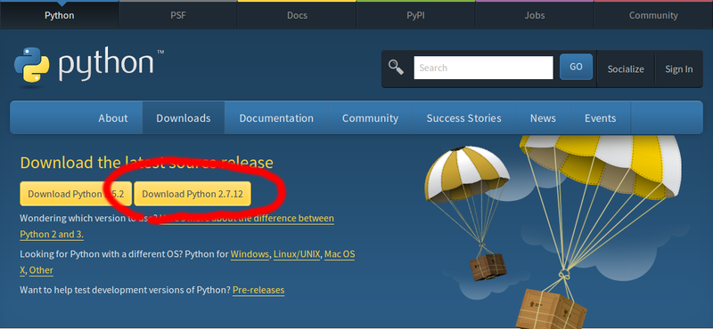

# Pythonのインストール

## Windows
[https://www.python.org/downloads/](https://www.python.org/downloads/)
にアクセスしてPython2.7のインストーラーをダウンロードします。



## Ubuntu
おそらく最初からインストールされていると思いますが、
もしされていなければaptでインストールできます。
``` sh
$ sudo apt-get install python
$ python --version
Python 2.7.12
```

## Mac
`homebrew install python`とかそのへんで適当に。
