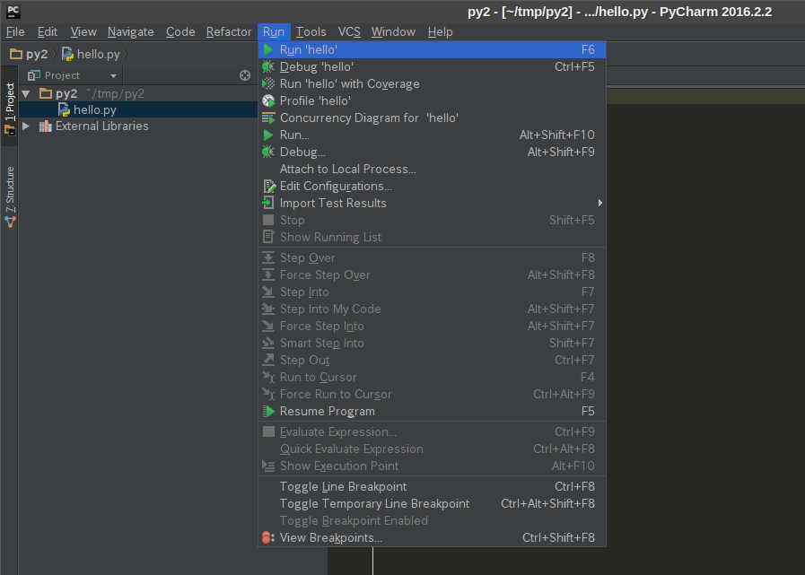

# PyCharm
個人的にオススメしているIDE（統合開発環境）です。

## インストール
[https://www.jetbrains.com/pycharm/download/](https://www.jetbrains.com/pycharm/download/)
にアクセスしてCommunity版（無料版）のインストーラーをダウンロードします。
ちなみに学校のメールアドレス（末尾がac.jpのやつ）でアカウントを作るとProfessional版も利用できます。

## 新規プロジェクトの作成

- Pytharmを起動し「Create New Project」を選択 
  

- 左のリストの「Pure Python」を選択し、プロジェクトを作成する場所とPythonのバージョンを入力 
  

- Project → さっき作成したフォルダ（右クリック） → New → Python File 
  

- 適当なファイル名を入力 
  

- 適当にプログラムを入力 
  

- メニューバーの Run → Run '...' で実行 
  

- 実行結果 
  

## 使用頻度の高い操作

- Help → Find Action 
  各種操作・設定項目を検索できます。
  使い方を忘れたらとりあえずコレ。

- Code → Reformat Code 
  設定されたコーディングスタイルに沿って半角スペースの位置や空行の数などを調整してくれます。
  原則、保存する前に毎回押しましょう。(面倒ならマクロを組みましょう)

- Refactor → Rename... (`Ctrl + r`) 
  変数名や関数名の一括置換です。なかなか賢く動きます。

- Show Intention Actions (`Alt + Enter`) 
  ソースコードに警告が出ているときなどに使うショートカット。
  予測される操作の一覧がポップアップ表示されるので、選んでEnterを押せば実行されます。

  （実用例）
  * 「プログラムの最後は改行したほうが良い」と警告が出ている。 
    

  * `Alt + Enter`を押すとヒントが表示される。「Reformat file」を選択してEnterを押す。 
    

  * 改行が追加された。
    

## 補足
VisualStudio、Eclipse、Netbeansなどのキーマップが予め用意されているので
デフォルトのショートカットキーが使いにくければ使い慣れたものに変えましょう。
